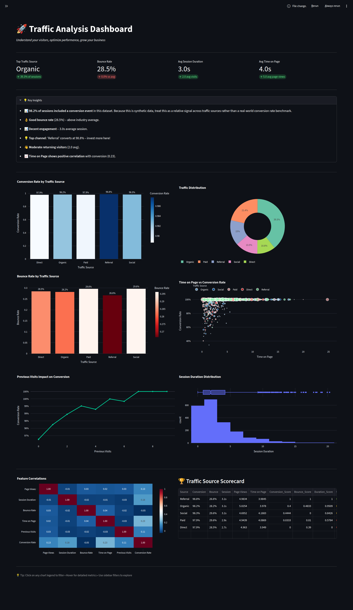
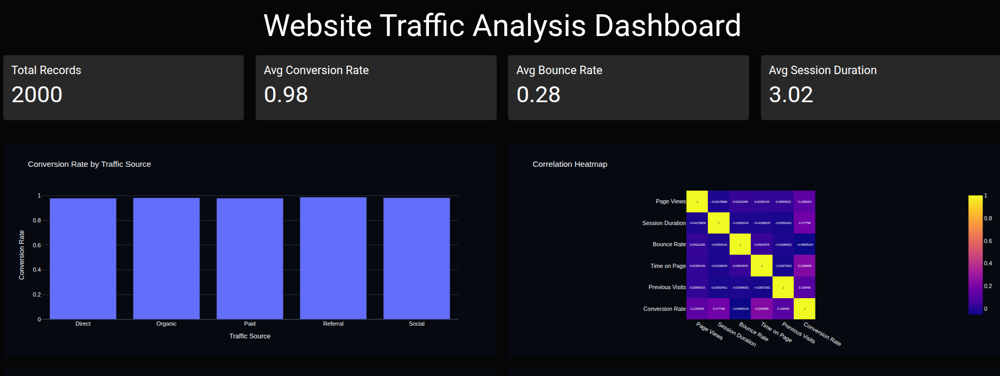
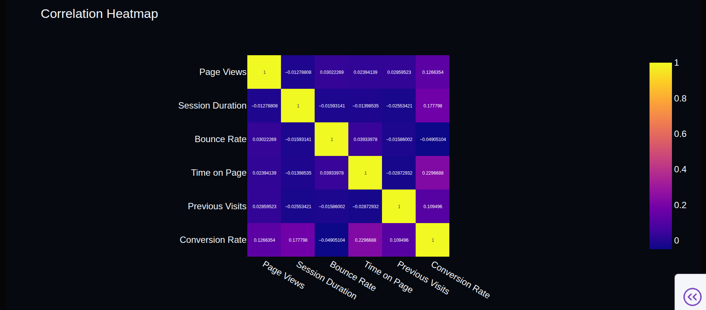

# Website Traffic Analysis Dashboard

**Note**: This analysis uses synthetic e-commerce data. Conversion metrics represent 

## Project Overview

This project analyzes website traffic and user engagement data to identify factors that influence conversion rates. The goal is to understand visitor behavior and provide actionable business recommendations.

## Business Problem

Businesses invest significant resources in acquiring website traffic. Understanding which traffic sources, user behaviors, and engagement metrics contribute to conversions can help optimize marketing strategies and improve website performance.

## Dataset Information

The dataset contains 2,000 website visit records with the following variables:

* Page Views
* Session Duration
* Bounce Rate
* Traffic Source
* Time on Page
* Previous Visits
* Conversion Rate

## Tools Used

* Python
* Pandas
* NumPy
* Matplotlib
* Seaborn
* Plotly
* Dash
* Dash Bootstrap Components

## Exploratory Data Analysis

The following analyses were performed:

* Dataset overview
* Missing value analysis
* Duplicate record detection
* Statistical summary
* Traffic source analysis
* Conversion analysis
* Distribution analysis
* Correlation analysis

## Business Questions

1. Which traffic source drives the most visitors?
2. Which traffic source achieves the highest conversion rate?
3. Does longer session duration improve conversion?
4. Does bounce rate negatively impact conversion?
5. Do returning visitors convert more effectively?

## Dashboard Features

* Dark themed responsive dashboard
* KPI cards
* Conversion rate analysis
* Bounce rate distribution
* Session duration distribution
* Correlation heatmap
* Business recommendations

## Dashboard Screenshots

### Full Dashboard

### Dashboard Overview

### Correlation Heatmap

### Recommendations Section

## Key Findings

* Traffic source significantly impacts conversion performance.
* Longer session duration is associated with stronger engagement.
* Bounce rate negatively affects website performance.
* Returning visitors demonstrate higher engagement behavior.
* User engagement metrics influence conversion outcomes.

## Business Recommendations

* Invest more resources in the highest-performing traffic source.
* Improve landing page experience to reduce bounce rates.
* Enhance content quality to increase engagement time.
* Develop remarketing campaigns targeting returning visitors.
* Continuously monitor engagement metrics to improve conversions.

## Project Structure

website-traffic-analysis/

├── data/

│ └── traffic.csv

├── notebooks/

│ └── traffic_analysis.ipynb

├── dashboard/

│ └── app.py

├── images/

│ ├── dashboard-overview.png

│ ├── correlation-heatmap.png

│ └── recommendations-section.png

├── requirements.txt

├── README.md

└── .gitignore

## How to Run

1. Clone the repository

2. Create and activate a virtual environment

3. Install dependencies

pip install -r requirements.txt

4. Run dashboard

python dashboard/app.py

5. Open browser

http://127.0.0.1:8050

## Author

Abdullah

Data Analytics Project
